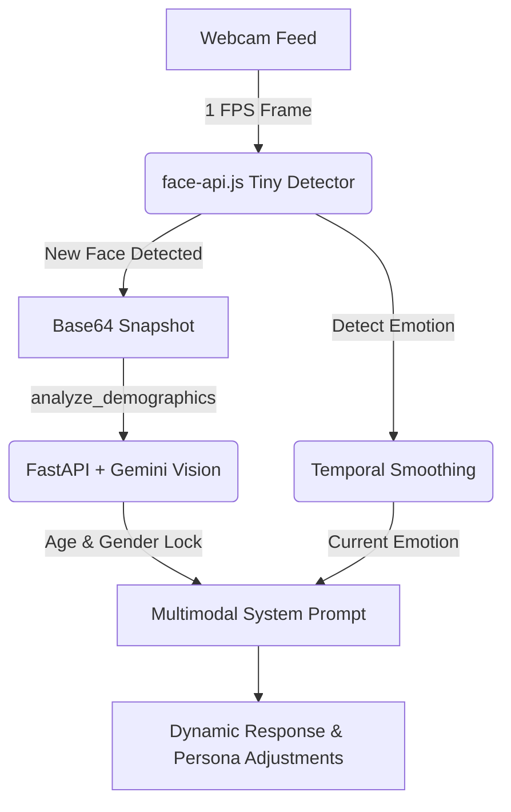

# Real-Time Emotion-Aware Multimodal Voice Assistant

A low-latency, full-duplex AI voice assistant that runs entirely within the browser's free-tier constraints. By combining face tracking, custom hardware/software echo cancellation, and real-time vision analytics, it adapts its personality, response tone, and voice style dynamically to match your age, gender, and emotional expression.

---

## 🌟 Key Features

- **Zero-Cost & Low-Latency Architecture**: Utilizes standard browser APIs, public model CDNs, FastAPI WebSockets, and rapid-response LLM endpoints to achieve near-instantaneous conversation speeds.
- **Multimodal Context Integration**:
  - **Real-Time Facial Emotion Tracking**: Uses `face-api.js` directly in the browser to analyze expressions at 1 FPS (neutral, happy, sad, angry, surprised, etc.) with temporal smoothing across a 5-frame moving average.
  - **Gemini Vision Demographic Lock**: Captures a single lightweight camera frame when a new face is detected and sends it to `gemini-2.5-flash` to accurately identify your age and gender. This locks to prevent fluctuating metrics.
- **Dynamic Persona & Tone Adaptation**: Adapts the AI's internal system instructions and speech styles based on demographic indicators (e.g., talking sweet/playful to children, sophisticated/mature to adults) and emotional states (e.g., matching enthusiasm or applying gentle de-escalation for anger/sadness).
- **Aggressive Software Acoustic Echo Cancellation (AEC)**:
  - **Stage 1 (Hardware)**: Requests echo cancellation, noise suppression, and automatic gain control directly from the audio device.
  - **Stage 2 (Software Matching)**: Actively screens mic inputs against the AI's most recently generated spoken phrases using fuzzy word-level and exact substring algorithms to filter speaker feedback.
  - **Stage 3 (Frequency Filtering)**: Applies a highpass `BiquadFilterNode` at 300Hz to eliminate low-frequency room booms before feeding audio to speakers, keeping the microphone feedback threshold low.
- **Proactive AI Interruptions**: Enables the assistant to dynamically interrupt the user mid-speech with immediate spoken empathy responses if the user's expression registers as highly angry, sad, or happy (>85% confidence).
- **Ultra-Low Latency Barge-In**: The frontend instantly halts playback the exact millisecond the user starts speaking or interrupts.

---

## 📂 Project Structure

```plaintext
Voice_Model_with_full_duplex/
├── backend/
│   ├── main.py              # FastAPI server, LLM orchestrator, & TTS generator
│   ├── requirements.txt     # Python backend dependencies
│   └── .env                 # API keys (Groq, OpenAI, Gemini, ElevenLabs)
├── frontend/
│   ├── index.html           # Elegant, modern dark-themed browser interface
│   └── app.js               # Web Speech API, face-api.js, and audio playback engine
├── start_assistant.bat      # One-click startup script for Windows users
└── README.md                # Project documentation
```

---

## 🛠️ Setup Instructions

### 1. Prerequisites

Ensure you have the following installed on your machine:
- **Python 3.9+**
- **Git**
- A modern browser (Chrome or Edge recommended for optimal Web Speech API support)

---

### 2. Installation & Server Start

#### Option A: One-Click Startup (Windows)
Since you are already inside the workspace, simply run the pre-configured batch file to spawn both servers and launch the web interface automatically:
```bash
.\start_assistant.bat
```

#### Option B: Manual Setup

1. **Clone the Repository**:
   ```bash
   git clone https://github.com/SaiNanduVajhala/Voice_Model_with_full_duplex.git
   cd Voice_Model_with_full_duplex
   ```

2. **Backend Configuration**:
   - Navigate to the `backend` folder:
     ```bash
     cd backend
     ```
   - Create a virtual environment and activate it:
     ```bash
     python -m venv .venv
     # Windows:
     .venv\Scripts\activate
     # macOS/Linux:
     source .venv/bin/activate
     ```
   - Install dependencies:
     ```bash
     pip install -r requirements.txt
     ```
   - Create a `.env` file in the `backend` folder and insert your API keys:
     ```ini
     GROQ_API_KEY=gsk_your_key_here
     OPENAI_API_KEY=sk_your_key_here
     GEMINI_API_KEY=AIzaSy_your_key_here
     ELEVENLABS_API_KEY=your_key_here
     # Optional:
     # OPENROUTER_API_KEY=your_key_here
     ```
   - Launch the WebSocket server:
     ```bash
     python -m uvicorn main:app --reload
     ```

3. **Frontend Server Setup**:
   Browser security policies require webcam feeds and AudioContexts to be served over `localhost` or HTTPS.
   - Open a new terminal and navigate to the `frontend` folder:
     ```bash
     cd ../frontend
     ```
   - Spin up a local HTTP server:
     ```bash
     python -m http.server 8080
     ```
   - Open your browser and navigate to: **[http://localhost:8080](http://localhost:8080)**

---

## ⚙️ Configuration Reference

The backend routing configurations are managed in `backend/main.py` under the `CONFIGURATION` section:

| Setting | Options | Description |
|---|---|---|
| `ACTIVE_LLM_PROVIDER` | `"groq"`, `"openai"`, `"gemini"`, `"openrouter"` | The LLM API to handle conversations. |
| `ACTIVE_LLM_MODEL` | Match standard models (e.g., `"llama-3.1-8b-instant"`, `"gemini-2.5-flash"`) | Model name used for generation. |
| `ACTIVE_TTS_PROVIDER` | `"elevenlabs"`, `"edge-tts"`, `"openai_tts"` | Output speech audio provider. |
| `TTS_VOICE_EDGE` | Any valid Edge TTS neural voice name | Fallback voice for Edge TTS. |
| `TTS_VOICE_OPENAI` | `"alloy"`, `"echo"`, `"fable"`, `"onyx"`, `"nova"`, `"shimmer"` | Fallback voice for OpenAI TTS. |

---

## 🔬 Under the Hood: Core Workflows

### 1. Unified Multimodal Feed


### 2. Software-Based Acoustic Echo Cancellation
To prevent the microphone from picking up the user's laptop speaker sounds (which normally causes feedback loops or false user interruptions):
- When the AI generates a response, the exact output phrases are stored.
- The microphone stream is transcribed in real-time.
- If a mic transcript segment perfectly matches or contains significant words from the AI's recently spoken text, the chunk is flagged as `isEcho` and dropped immediately.
- A **Hot-word Bypass** list (e.g., *"stop"*, *"wait"*, *"hold on"*, *"pause"*) overrides this check, ensuring that if you say one of these trigger words, the AI stops speaking instantly.

---

## 💻 Technical Stack

- **Frontend**: Vanilla JavaScript (ES6+), HTML5, CSS3 Glassmorphism UI.
- **Face & Emotion Tracking**: `face-api.js` (Web Client).
- **Backend & Middleware**: FastAPI, WebSockets (`websockets`), `python-dotenv`.
- **Text-to-Speech (TTS)**: `edge-tts` (zero-latency Microsoft Edge engine), `ElevenLabs` (Extreme Latency Optimized via streaming chunks), `OpenAI TTS`.
- **Large Language Models (LLM)**:
  - **Text generation**: Llama 3.1 8B via Groq, OpenAI GPT series, Gemini 2.5 series.
  - **Vision/Demographics**: Gemini 2.5 Flash.

---

## 🔒 License

This project is licensed under the MIT License.
